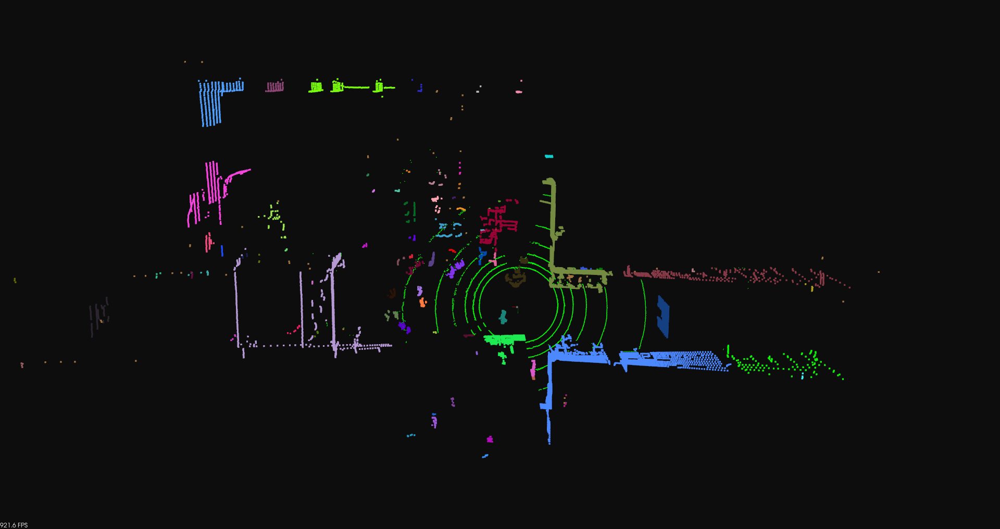

# 📝  Pointcloud Segmentation by Curved-Voxel Clustering #
***



## :tada: TODO
***

- [x] Pointcloud Segmentation by Curved-Voxel Clustering
- [x] Test on pointcloud data, benchmark processing speed
- [ ] GPU version (this type of voxelization is not so difficult to be parallelized on CUDA).

## 🎛  Dependencies
***

```bash
sudo apt-get install \
    libpcl-dev \
```

## 🔨 How to Build ##
***
```bash
make all # to build the library
make apps # to build the examples
```

## :running: How to Run ##
***

- There are 3 pcd files of velodyne vlp 16, velodyne hdl 32, livox stored in data. To run the sample app, do:

```bash
./build/examples/clustering_app ./data/velodyne_vlp_16.pcd

# or test on other sample pcds
```

## :gem: References ##
***

1. [Curved-Voxel Clustering for Accurate Segmentation of 3D LiDAR Point Clouds with Real-Time Performance, IROS 2019](https://datalab.snu.ac.kr/~ukang/papers/cvcIROS19.pdf)
1. [An implementation of Curved Voxel Clustering](https://github.com/wangx1996/Lidar-Segementation)
